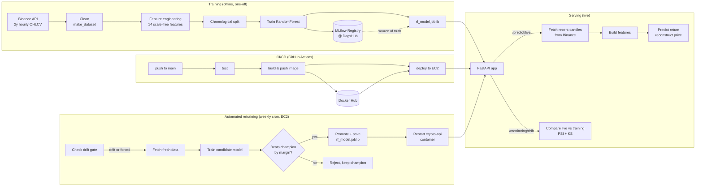

# 🪙 Crypto Price Forecasting — MLOps Pipeline

An end-to-end **MLOps pipeline** that forecasts the **next-hour Bitcoin price** from live Binance market data — with model tracking, data-drift monitoring, containerisation, automated retraining, and fully automated CI/CD to the cloud.


> **Live demo:** `http://35.154.66.239:8000/docs`  ·  health: `http://35.154.66.239:8000/health`

---

## 📖 What this project is (and what it isn't)

This is an **MLOps engineering showcase**, **not** a money-making trading bot.

Profitably predicting short-term crypto prices is unrealistic — markets are efficient and you'd be competing with hedge funds. Chasing that would be dishonest. So the **model is deliberately modest**, and the value on display is everything *around* it: a production-shaped lifecycle that takes a live data source all the way to a monitored, auto-deployed, and **self-retraining** API.

> **Honest result:** the tuned model beats a naive "predict 0% return" baseline by only ~`1e-5` RMSE. That's **expected** — hourly crypto behaves close to a random walk. A *large* improvement would signal data leakage, not skill. The engineering, not the accuracy, is the point.

---

## 🏗️ Architecture



---

## 🧰 Tech stack

| Layer | Tool |
|---|---|
| Language | Python 3.13 |
| Data source | Binance public API (`python-binance`) |
| Data versioning | DVC → DagsHub remote |
| Modelling | scikit-learn (RandomForest), Optuna (tuning), XGBoost (baseline) |
| Experiment tracking / registry | MLflow @ DagsHub |
| Serving | FastAPI + Uvicorn |
| Drift detection | PSI + KS test (`scipy`) |
| Automated retraining | Weekly cron on EC2, drift-gated, margin-based promotion |
| Containerisation | Docker |
| CI/CD | GitHub Actions |
| Deployment | AWS EC2 (non-US region) + Elastic IP |
| Config | YAML (single source of truth) |

---

## 📁 Project structure

```
Crypto-Price-Forecasting-MLops/
├── config/
│   └── config.yaml              # ⭐ single source of truth + design-decision notes
├── data/
│   ├── raw/btc.parquet(.dvc)    # DVC-tracked historical OHLCV
│   └── processed/               # cleaned data, features, train/test splits
├── models/
│   └── rf_model.joblib          # trained model (MLflow registry = source of truth)
├── notebooks/
│   ├── 01_eda.ipynb             # exploratory data analysis
│   └── 02_model_experiment.ipynb# Optuna + TimeSeriesSplit tuning, MLflow runs
├── src/
│   ├── config.py                # loads config.yaml, resolves project-root paths
│   ├── data/
│   │   ├── data_ingestion.py    # fetch OHLCV from Binance (+ fetch_recent_candles)
│   │   ├── make_dataset.py      # defensive cleaning (dedup, gap-fill)
│   │   └── make_split.py        # chronological train/test split (no shuffle)
│   ├── features/
│   │   └── make_features.py     # add_features() (serving) / build_features() (train)
│   ├── models/
│   │   ├── model_training.py    # train + log + register to MLflow
│   │   ├── retrain.py           # drift-gated retrain, promotion, container restart
│   │   └── predict.py           # inference (return → price), predict_from_candles()
│   ├── monitoring/
│   │   └── drift.py             # PSI/KS drift report + get_current_features()
│   └── api/
│       └── app.py               # FastAPI: /health /predict /predict/live /monitoring/drift
├── tests/                       # pytest — predict, API (mocked), drift, retrain
├── Dockerfile                   # slim serving image (built in CI)
├── requirements.txt             # full env (training + notebooks)
├── requirements-ci.txt          # slim env (serving + tests) → used by CI & Docker
├── requirements-train.txt       # training-only env (mlflow, dvc, xgboost, optuna) → EC2 retrain
├── .env.example                 # template for DagsHub/MLflow credentials
└── .github/workflows/ci.yml     # test → docker → deploy
```

---

## 🧭 Key design decisions

The reasoning behind the big calls (also embedded as comments at the top of `config/config.yaml`):

1. **Predict *return*, not raw price.** Target = `close.shift(-1)/close - 1`; price is rebuilt as `price × (1 + return)`. BTC keeps making new all-time highs, and **tree models can't extrapolate beyond prices seen in training** — a scale-free return target sidesteps that entirely.
2. **Every feature is scale-free** — hourly returns + lags, `close / moving-average` ratios, rolling volatility, and `log(volume)`. Nothing that grows with price, so the model generalises to future price regimes.
3. **Fixed hyperparameters in production.** The Optuna + `TimeSeriesSplit` search lives in the notebook; production training just *reads* the winning params from config → fast, deterministic, reproducible runs.
4. **PSI decides drift; KS is informational.** On ~14k reference rows the KS test flags *every* feature (it's over-sensitive on large samples — p-value ≈ 0 even for stable features). **PSI is sample-size robust**, so PSI is the decision metric and KS is reported for context.
5. **Chronological split, no shuffle.** It's a time series — the last 20% of time is the test set. Shuffling would leak the future into training.
6. **Binance as the live source.** Real-time, fine granularity, no API key for public data. **Caveat handled:** Binance.com is geo-blocked in the US (HTTP 451), so EC2 is deployed in a **non-US region**.
7. **Two-layer serving contract.** `/predict` takes engineered features (testable, decoupled); `/predict/live` fetches its own data and needs no input — the automatic path built on top.
8. **MLflow registry is the source of truth.** The committed `rf_model.joblib` is a convenience copy baked into the serving image, and it's what the retrain job overwrites when a candidate is promoted.
9. **Promotion is margin-gated, not just "better."** A candidate must beat the champion's RMSE by at least a configured margin to be promoted — this stops the champion from being swapped out due to run-to-run noise.

---

## 🔌 API endpoints

| Method | Path | Description |
|---|---|---|
| `GET` | `/health` | Liveness + whether the model file is present |
| `POST` | `/predict` | Predict from the 14 engineered features (optionally returns price) |
| `GET` | `/predict/live` | **Fully automatic** — fetches Binance, builds features, predicts. No body needed |
| `GET` | `/monitoring/drift` | Compares ~30d of live features vs training data → per-feature PSI/KS report |

Interactive docs (Swagger UI) at **`/docs`**.

**Example — live prediction:**
```bash
curl http://35.154.66.239:8000/predict/live
```
```json
{
  "as_of_time": "2026-08-12T05:00:00",
  "current_price": 118420.15,
  "predicted_return": 0.00012,
  "predicted_price": 118434.36,
  "predicted_for_time": "2026-08-12T06:00:00"
}
```

---

## 🔁 The MLOps loop

```
live data ──▶ predict ──▶ periodic drift check (PSI)
                              │
                 no drift ────┴──── drift detected
                    │                    │
              keep current         retrain candidate
                                         │
                              validate → promote only if it beats
                                         champion by margin
                                         │
                              restart serving container
                                    (new model live)
```

Drift is checked on a **batch** (a window of recent candles), not per-candle — ordinary hourly price movement is normal and is **not** drift. Drift means the *distribution* of recent data has shifted away from what the model was trained on.

---

## ♻️ Automated retraining

Retraining runs as a **weekly cron job directly on the EC2 host** (not inside the serving container — see [why](#-why-retraining-runs-on-the-host-not-in-a-container) below):

```
0 2 * * 0  cd ~/Crypto-Price-Forecasting-MLops && venv/bin/python -m src.models.retrain >> retrain_cron.log 2>&1
```

**What happens on each run (`src/models/retrain.py`):**

1. **Drift gate** — `should_retrain()` checks PSI-based drift on recent live data. If nothing has drifted, the run exits early with no training (saves compute, avoids needless churn). Can be bypassed with `--force` for manual/first-time runs.
2. **Fetch + train** — pulls fresh Binance data and trains a candidate model with the fixed, previously-tuned hyperparameters.
3. **Evaluate** — candidate and current champion are both scored on the same held-out test set (RMSE, MAE, R², directional accuracy).
4. **Promote or reject** — `decide_promotion()` promotes the candidate **only if it beats the champion's RMSE by at least the configured margin**; otherwise the champion is kept. Every run — promoted or rejected — is logged to MLflow/DagsHub for full traceability.
5. **Hot-swap the model** — if promoted, the new `rf_model.joblib` is written to the host-mounted `models/` directory and `crypto-api` is restarted so the running API immediately serves the new model, with **no image rebuild and no CI/CD run required**.

### Why retraining runs on the host, not in a container
- The serving image is intentionally **slim** (`requirements-ci.txt`) and excludes training tooling (`mlflow`, `dvc`, `xgboost`, `optuna`) to keep it small and fast to deploy. Training deps live only in `requirements-train.txt`, installed once in a host-level `venv`.
- `models/` is **volume-mounted** into `crypto-api`, so a retrain on the host writing `rf_model.joblib` is picked up by a simple `docker restart` — no rebuild needed.
- `cron` needs a long-lived host to fire on schedule; the EC2 box is already always-on for serving, so it doubles as the training scheduler at no extra infrastructure cost.

### Run it manually
```bash
source venv/bin/activate
python -m src.models.retrain --force   # skip the drift gate, always retrain
python -m src.models.retrain           # normal path: only retrains if drift detected
```

---

## 🚀 Quickstart (local)

### Prerequisites
- Python 3.13
- (For training/tracking) a free [DagsHub](https://dagshub.com) account

### 1. Clone & install
```bash
git clone https://github.com/AliRaza3485/Crypto-Price-Forecasting-MLops.git
cd Crypto-Price-Forecasting-MLops

pip install -r requirements.txt        # full env (training + notebooks)
# or, just to run the API + tests:
# pip install -r requirements-ci.txt
# or, just to train/retrain:
# pip install -r requirements-train.txt
```

### 2. Configure credentials (only needed for training / MLflow)
```bash
cp .env.example .env
# then fill in your DagsHub token — see .env.example
```

### 3. Run the pipeline (each stage is a module, run from the project root)
```bash
python -m src.data.data_ingestion     # Binance → data/raw/btc.parquet
python -m src.data.make_dataset       # clean → data/processed/btc_clean.parquet
python -m src.features.make_features  # → btc_features.parquet
python -m src.data.make_split         # chronological → X/y_train, X/y_test
python -m src.models.model_training   # train + log + register to MLflow
```

### 4. Serve the API
```bash
uvicorn src.api.app:app --reload
# → http://127.0.0.1:8000/docs
```

> ℹ️ Binance is geo-blocked in the US (HTTP 451). If `/predict/live` fails locally with a 503 from a US network, run behind a non-US connection (this is exactly why the cloud box is in a non-US region).

---

## 🐳 Docker

The serving image is **slim** — it ships only what the API needs (`requirements-ci.txt` + `src/`, `config/`, `models/`); all training/notebook tooling is excluded.

```bash
# build
docker build -t crypto-price-forecasting .

# run
docker run -d --name crypto-api -p 8000:8000 crypto-price-forecasting
# → http://localhost:8000/health
```

The image is built and pushed by CI (not locally). Pull the published one:
```bash
docker pull ar3080331/crypto-price-forecasting:latest
```

---

## ⚙️ CI/CD

`.github/workflows/ci.yml` runs three jobs on every push to `main`:

| Job | When | What it does |
|---|---|---|
| **test** | every push & PR | Installs `requirements-ci.txt`, runs the full pytest suite |
| **docker** | push to `main` only (after tests pass) | Builds the image, pushes `:latest` + `:<sha>` to Docker Hub (with layer cache) |
| **deploy** | push to `main` only (after docker) | SSHes into EC2, pulls `:latest`, frees port 8000, restarts the container, prunes old layers |

**Required repo secrets** (Settings → Secrets and variables → Actions):

| Secret | Purpose |
|---|---|
| `DOCKERHUB_USERNAME` | Docker Hub username (also the image namespace) |
| `DOCKERHUB_TOKEN` | Docker Hub access token |
| `AWS_EC2_HOST` | EC2 Elastic IP / public DNS |
| `AWS_EC2_USER` | SSH user (`ubuntu`) |
| `AWS_EC2_SSH_KEY` | Contents of the `.pem` private key |

The deploy step **frees port 8000 from *any* container** before starting the new one, so a container started manually (under a different name) never blocks a deploy.

> Note: CI/CD handles *code* deploys (pushes to `main`). Model deploys from retraining are a separate, faster path — see [Automated retraining](#-automated-retraining) above — and don't go through this pipeline at all.

---

## 📊 Drift monitoring

`src/monitoring/drift.py` compares the feature distributions the model was **trained on** (`X_train`, the *reference*) against **recent live** features (the *current* batch).

- **PSI** (Population Stability Index) — the decision metric. `< 0.10` stable · `0.10–0.20` moderate · `≥ 0.20` major drift.
- **KS test** p-value — reported for context (over-sensitive on large samples, so not used to decide).
- Overall drift is flagged once **≥ `min_drifted_features`** features cross the major threshold.
- This same PSI check is the **gate for automated retraining** — see above.

Run standalone, or hit the endpoint:
```bash
python -m src.monitoring.drift
# or
curl http://35.154.66.239:8000/monitoring/drift
```

A real 30-day-vs-2-year run showed **volatility and volume features drifting hard while all `return_*` features stayed stable** — live proof that the scale-free *return* target (decision #1) is the most robust feature family.

> ⚠️ **Known limitation:** the drift reference `data/processed/X_train.parquet` is git-ignored and **not baked into the Docker image**, so `/monitoring/drift` returns **503 in the container**. `/predict` and `/predict/live` work fully. The EC2 retrain job has its own copy on the host, so the drift gate for retraining is unaffected. Fix planned via committing the reference or DVC-pulling it in CI.

---

## 🧪 Tests

```bash
python -m pytest tests/ -v
```
Pytest suite covering inference (`predict`), the API via `TestClient` (Binance calls **mocked** — no network, no flakiness in CI), drift maths, and the retrain/promotion logic (`tests/test_retrain.py` is skipped automatically in the slim CI env, since it needs `mlflow` — see `requirements-train.txt`).

---

## ⚠️ Known limitations (honest)

- **Accuracy is intentionally modest** — see the framing above; this is by design and by the nature of the data.
- **`/monitoring/drift` returns 503 in the container** — drift reference not yet shipped in the serving image (the host-side retrain job is unaffected).
- **Retraining runs on a single host, not orchestrated** — it's a `cron` job on the same EC2 box that serves the API, not a separate training cluster or workflow orchestrator. Fine at this scale; wouldn't scale to a fleet of models.
- **Small EC2 instance** — training runs with a swap file to avoid OOM kills on a low-RAM box; a bigger instance would be the "real" fix for a production system.

---

## 🗺️ Roadmap

- [x] Data ingestion + DVC versioning
- [x] EDA, feature engineering, chronological split
- [x] Model training + MLflow registry (DagsHub)
- [x] FastAPI serving (`/predict`, `/predict/live`)
- [x] Data-drift monitoring (PSI/KS)
- [x] Dockerised serving image
- [x] CI/CD: test → build/push → deploy to EC2
- [x] Automated, drift-gated retraining with margin-based promotion (weekly cron on EC2)
- [ ] Ship drift reference into the image (fix `/monitoring/drift` in prod)
- [ ] Next.js dashboard (forecast + drift status + model version + last-retrained)
- [ ] Evidently AI reports for richer drift visualisation

---

## 📦 Portfolio context

This is **project 4 of a 5-part MLOps portfolio series**, each shipped end-to-end (FastAPI + MLflow + Docker + GitHub Actions + AWS + frontend):

1. Insurance Premium Prediction (regression)
2. Credit Card Fraud Detection (extreme-imbalance classification)
3. Demand Forecasting
4. **Crypto Price Forecasting** ← *you are here* — adds a **live streaming data source**, **drift monitoring**, and **automated retraining**
5. *(upcoming)*

---

*Built as a learning-first, honesty-first MLOps project. The infrastructure is the deliverable.*